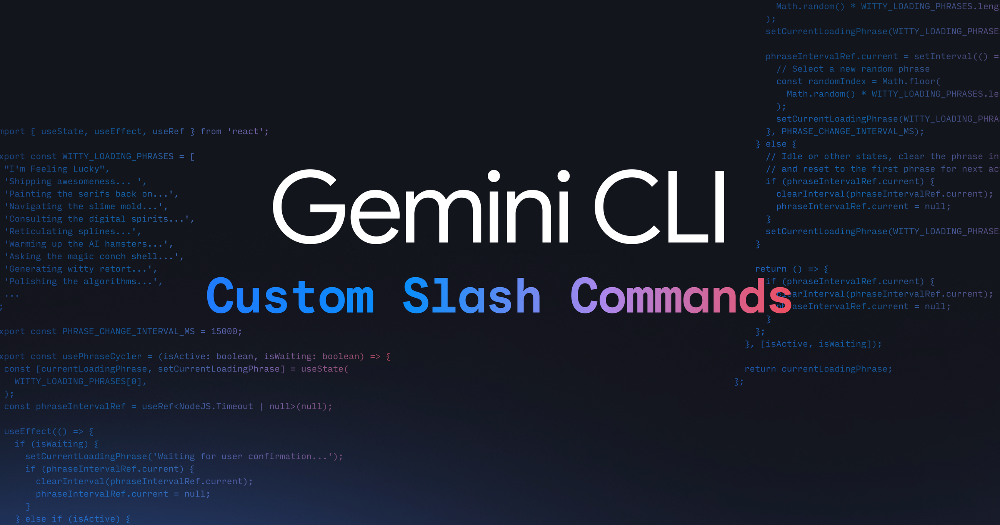

# Gemini CLI：自定义斜杠命令

今天，谷歌宣布在 Gemini CLI 中支持自定义斜杠命令。此功能允许用户定义可重用的提示，以简化他们与 Gemini CLI 的交互并提高工作流程效率。斜杠命令可以在本地 `.toml` 文件中定义，也可以通过模型上下文协议 (MCP) 提示来定义。

要使用斜杠命令，您需要更新到最新版本的 Gemini CLI。

### 使用 `.toml` 文件创建自定义斜杠命令

自定义斜杠命令基于 `.toml` 文件。文件名定义了命令名称，文件内容指定了命令的行为。`.toml` 文件有一组最少的必需键，其中 `prompt` 是唯一强制性的。您可以使用 `{{args}}` 传递参数，并使用 `!{...}` 在提示中执行 shell 命令。

例如，可以创建一个 `/review <issue_number>` 命令来审查 GitHub 拉取请求。`review.toml` 文件将包含一个提示，该提示使用 `gh` CLI 命令查看 PR、其差异并发布审查。

通过将命令组织到子目录中，可以对命令进行命名空间划分。例如，在 `.gemini/commands/git/commit.toml` 中定义的命令将作为 `/git:commit` 调用。

通过将自定义斜杠命令放置在 `~/.gemini/commands/` 中，可以使其在用户范围内（在所有项目中可用），或者通过将其放置在 `.gemini/commands/` 中，可以使其在项目范围内（仅在特定项目中可用）。

### 构建 `/plan` 命令

本文提供了创建 `/plan` 命令的分步指南：

1.  **创建命令文件**：在 `~/.gemini/commands/` 中创建一个名为 `plan.toml` 的文件。
2.  **添加命令定义**：向 `plan.toml` 文件添加 `description` 和 `prompt`。该提示指示 Gemini 充当战略家，调查代码库，并创建一个详细的计划来实现给定的目标，而无需编写任何代码。
3.  **使用命令**：然后，您可以在 Gemini CLI 中像这样使用该命令：`/plan How can I make the project more performant?`。

### 与 MCP 提示集成

Gemini CLI 还通过支持 MCP 提示作为斜杠命令与 MCP 集成。MCP 提示的名称和描述将用作斜杠命令的名称和描述，并且支持参数。

要开始使用，您可以升级您的 Gemini CLI 并参阅自定义命令文档。
