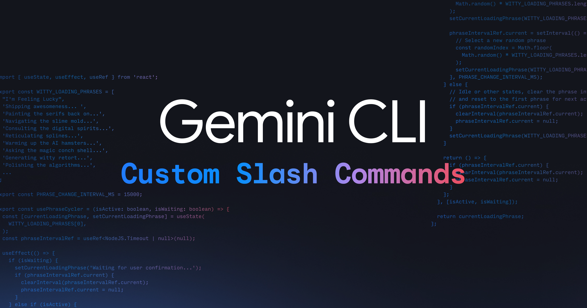

# Gemini CLI: Custom slash commands

Today, Google announced support for custom slash commands in Gemini CLI. This feature allows users to define reusable prompts to streamline their interactions with Gemini CLI and improve workflow efficiency. Slash commands can be defined in local `.toml` files or through Model Context Protocol (MCP) prompts.

To use slash commands, you need to update to the latest version of Gemini CLI.

### Creating Custom Slash Commands with `.toml` files

Custom slash commands are based on `.toml` files. The file name defines the command name, and the file's content specifies the command's behavior. The `.toml` file has a minimal set of required keys, with `prompt` being the only mandatory one. You can use `{{args}}` to pass arguments and `!{...}` to execute shell commands within the prompt.

For example, a `/review <issue_number>` command can be created to review a GitHub pull request. The `review.toml` file would contain a prompt that uses `gh` CLI commands to view the PR, its diff, and post a review.

Commands can be namespaced by organizing them into sub-directories. For instance, a command defined in `.gemini/commands/git/commit.toml` would be invoked as `/git:commit`.

Custom slash commands can be user-scoped (available across all projects) by placing them in `~/.gemini/commands/` or project-scoped (available only within a specific project) by placing them in `.gemini/commands/`.

### Building a `/plan` command

The article provides a step-by-step guide to creating a `/plan` command:

1.  **Create the command file**: Create a file named `plan.toml` in `~/.gemini/commands/`.
2.  **Add the command definition**: Add a `description` and a `prompt` to the `plan.toml` file. The prompt instructs Gemini to act as a strategist, investigate the codebase, and create a detailed plan to achieve a given goal without writing any code.
3.  **Use the command**: You can then use the command in Gemini CLI like this: `/plan How can I make the project more performant?`.

### Integration with MCP Prompts

Gemini CLI also integrates with MCP by supporting MCP Prompts as slash commands. The name and description of the MCP prompt are used as the slash command's name and description, and arguments are supported.

To get started, you can upgrade your Gemini CLI and refer to the Custom Commands documentation.
